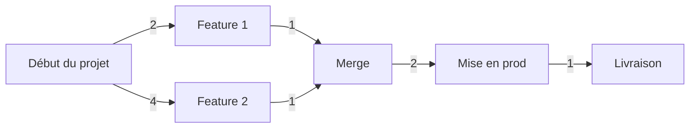

# Bienvenue sur mon Portfolio :)

Je m'appelle **Charles**, j'ai 21ans et je suis passionné de développement. Ayant commencé sur ma Casio au lycée j'ai vite accroché au concepte de faire faire à la machine ce qui nous prend du temps. Pourquoi perdre le sien maintes fois quand on peut l'optimiser ?

# Portfolio

Le portfolio a été réalisé avec un template Bootstrap que voici :
##### [> Start Bootstrap - Creative](https://startbootstrap.com/template-overviews/creative/)

# Projet

Ce portfolio est un requis à l'obtention du diplôme du BTS option SLAM. Son but est de présenter l'étudiant dans sa globalité, ses objectifs de carrière, son parcours, sa mission et vers quelle branche il souhaite se spécialisé.

### SLAM
- Filiare de développement, apprentissage de la POO dans ses bases, utilisation de framework CSS, et apprentissage des langages du web **HTML5**, **CSS3** et **PHP**.
	> 3 Projets réalisés dont la création d'une startup avec simulation de financement et création de produit. Business plan et simulation des coûts sur court et long terme.

### SISR

- Filiaire réseau avec apprentissage des règles de base en terme de sécurité. Mise en place de réseaux & sous-réseaux. Utilisation des outils Wireshark, Packet tracer et d'autres... Sys. admin avec gestion des comptes et groupes sur l'environnement Linux.
	> Un gros projet de création de parc pour une entreprise avec les règles de sécurité.
	
# Étude de projet

Analyse des délais de production d'un service avec utilisation du diagramme de **Gantt** ou de **Pert**

